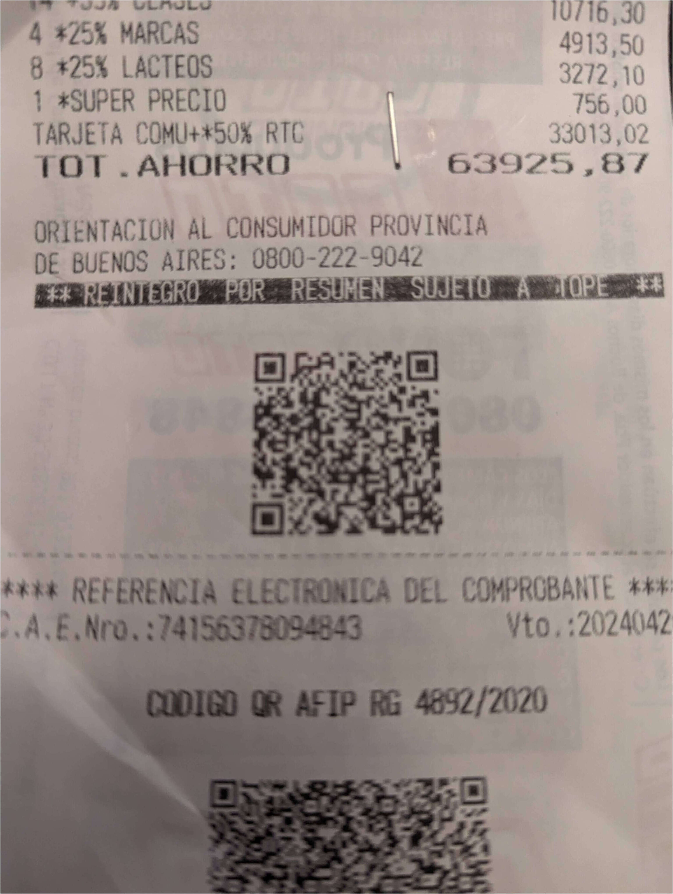

# Controlador de pedidos de Coto Digital

(No afiliado de ninguna forma con Coto)

Esta web te ayudará a controlar si te entregaron todos los productos del pedido de coto digital. Vas a usar la cámara del celular para escanear la factura y después marcarás todos los productos escaneando los códigos de barras!.

## Como usar

1. Entra en [https://cotodigital.vercel.app/](https://cotodigital.vercel.app/)
2. Toca el botón "ESCANEAR" que esta en la mitad de la pantalla
3. Escanea el QR de la factura de Coto.
4. Usa el botón de abajo a la derecha para activar el escaner de códigos de barra.
5. Escanea todos los productos
6. Revisa si faltó alguno!

## FAQs

### ¿De que QR me hablas?

Las facturas de COTO (tanto las que te dan en la caja o las envíadas con el pedido de Coto Digital), tienen dos QR al final de la factura:

El QR que tiene la información del pedido es el primero, el pequeño. Este es el QR que se debe escanear.

El segundo QR que es más grande es información de la AFIP, no es usado aquí.

### No funciona el escaner de QR, ¿Que puedo hacer?

Si tenes problemas escaneando el QR, utiliza cualquier escaner de QR (la cámara en iOS o Android), copia y pegá el link en la entrada que esta arriba de todo.

## TODO

- [x] Agregar producto mediante scannear no debería dejar agregar productos más que el existente
- [ ] Chequear que no se re marque un producto que ya fue marcado
- [x] Header: agregar link a github con explicación de como usar
- [ ] Github: agregar explicación de como usar
- [x] Header: clear (con confirm)
- [x] Home empty state
- [x] Home loading state
- [ ] Home error state
- [x] Pending Product List empty state
- [x] Fullfilled Product List empty state
- [ ] Mejorar ScannerDialog ([ver](https://m2.material.io/design/machine-learning/barcode-scanning.html#components))
- [ ] Limpiar componente de fab
- [ ] FavIcon / Meta Title
- [ ] `grep --exclude-dir=.next --exclude-dir=node_modules --exclude-dir=crawler -nHr 'TODO'`
- [x] Arreglar splash inicial de empty states de listas de productos
- [x] Cache en localstorage de última sesión (ticket, `useFetchCart`, `useCart`):
- [ ] Service Worker (cache de imagenes e instalar)
- [x] Onboarding
